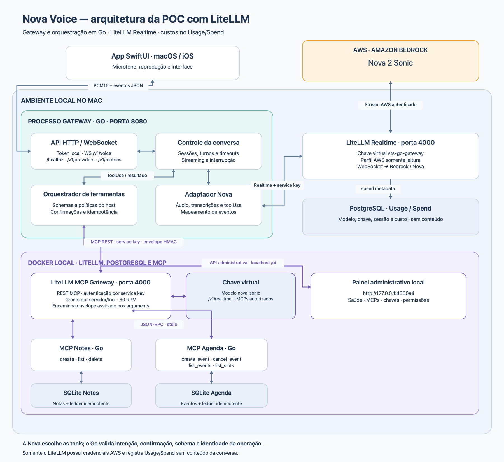

# STS Model POC

Assistente speech-to-speech em português brasileiro. O app Apple envia PCM16
para um gateway Go; o gateway mantém o controle da conversa e usa o endpoint
Realtime do LiteLLM para chegar ao Amazon Nova 2 Sonic no Bedrock.

```text
App Apple → gateway Go (:8080) → LiteLLM /v1/realtime (:4000) → Bedrock/Nova
                    ↕                    ↕
          políticas e tools       PostgreSQL Usage/Spend
                                         ↕
                               MCP Notes/Agenda → SQLite
```

O Go nunca recebe credenciais AWS. Ele usa uma chave virtual restrita ao
modelo `nova-sonic`, à rota Realtime e aos MCPs selecionados. LiteLLM é o único
componente com o perfil AWS e também a fonte de monitoramento de custo.



O PNG é gerado por `scripts/render_architecture.swift`. Depois de alterar o
fluxo, execute `make architecture-diagram` para mantê-lo sincronizado com a
documentação.

## Pré-requisitos

- macOS com Xcode para o app Apple;
- Go 1.27 ou mais recente;
- Python 3 para o supervisor local (não existe bridge Python de inferência);
- Docker Desktop;
- acesso ao Nova 2 Sonic em `us-east-1`.

## Início recomendado

Prepare um perfil AWS/SSO e o arquivo local `deploy/litellm/.env`. Depois:

```bash
make dev
```

O assistente escolhe provider, perfil AWS, MCPs, fixtures e exposição de rede.
Para Nova, ele:

1. sobe LiteLLM e PostgreSQL;
2. monta `~/.aws` somente no container LiteLLM, em modo somente leitura;
3. valida a identidade dentro desse container;
4. cria/atualiza a chave virtual `sts-go-gateway`;
5. compila e inicia apenas o gateway Go.

O app continua usando `ws://127.0.0.1:8080/v1/voice`; seu protocolo público
não mudou. O painel LiteLLM fica em <http://127.0.0.1:4000/ui>.

Veja o passo a passo completo de AWS, cadastro do modelo no painel e
Usage/Spend em [docs/nova-litellm-runbook.md](docs/nova-litellm-runbook.md).

## Execução manual

```bash
AWS_PROFILE=sts-poc make litellm-up

export STS_PROVIDER=nova
export STS_LITELLM_URL=http://127.0.0.1:4000
export STS_LITELLM_API_KEY='chave-virtual-sts-go-gateway'
export STS_LITELLM_REALTIME_MODEL=nova-sonic
export STS_GATEWAY_ADDRESS=127.0.0.1:8080
export STS_DEVELOPMENT_TOKEN=local-demo-token
make gateway
```

`deploy/litellm/config.yaml` é a configuração canônica do modelo. A imagem
LiteLLM está fixada por tag e digest no Dockerfile, incluindo o transporte
Bedrock Realtime.

## Imagem LiteLLM customizada

A POC constrói uma imagem derivada de
`ghcr.io/berriai/litellm-database:v1.103.0-dev.2`, fixada também por digest.
Não é um fork do LiteLLM: o Dockerfile aplica patches pequenos, auditáveis e
fail-closed durante o build para corrigir incompatibilidades observadas nessa
versão específica.

Os patches versionados em `deploy/litellm/patches/` fazem o seguinte:

- `redact_mcp_spend.py`: quando o armazenamento de prompts está desligado,
  remove `arguments` e `result` de `metadata.mcp_tool_call_metadata`. Permanecem
  somente metadados necessários para atribuição de uso e custo.
- `bedrock_realtime_turn_detection.py`: traduz o VAD da sessão para
  `turnDetectionConfiguration.endpointingSensitivity=MEDIUM` no `sessionStart`
  da Nova. Sem isso, a Nova podia transcrever o usuário e permanecer em escuta
  sem iniciar a resposta falada.
- O mesmo patch de Realtime aceita os argumentos de `toolUse` no campo Bedrock
  `content`, mantendo compatibilidade com o campo `input`. A versão base lia
  apenas `input`, transformando chamadas como `notes.create` em `{}`.
- Quando um `toolUse` chega sem `response_id` ou `output_item_id` anterior, o
  patch cria somente os identificadores de envelope OpenAI necessários. A
  versão base descartava silenciosamente essa chamada e deixava o turno aberto.

Os scripts verificam a forma exata do código-fonte da imagem e interrompem o
build caso ela tenha mudado. Ao atualizar a versão ou o digest do LiteLLM,
revise cada patch e remova-o somente depois de confirmar que a correção foi
incorporada upstream e que os testes Realtime, MCP e de privacidade continuam
passando.

Depois de alterar um patch, reconstrua e recrie apenas o LiteLLM:

```bash
docker compose \
  --env-file deploy/litellm/.env \
  -f deploy/litellm/compose.yaml \
  up -d --build --force-recreate litellm
```

O PostgreSQL não é recriado por esse comando; chaves e histórico de
Usage/Spend permanecem no volume existente.

## Persistência e privacidade

- PostgreSQL do LiteLLM: configuração, chaves e spend logs metadata-only.
- SQLite Notes/Agenda: dados funcionais e ledger de idempotência.
- Gateway Go: sem SQLite de auditoria; apenas logs estruturados efêmeros.
- Conteúdo de áudio, prompts, transcrições e payloads MCP não deve ser gravado
  pelo LiteLLM nem pelo gateway.

Bancos antigos não são apagados. As tabelas antigas `sessions`, `turns` e
`tool_operations` apenas deixam de ser criadas e utilizadas.

## Testes

```bash
make check
make dev-test
make apple-core-test
make apple-build-macos
make apple-build-ios
```

Os testes Go usam um servidor WebSocket Realtime falso e cobrem handshake,
áudio, transcrições, interrupção, tools, confirmação, renovação e falhas. O
smoke com AWS real é opt-in porque gera custo; consulte o runbook e confirme
Usage/Spend após executá-lo.

## Documentação

- [Arquitetura](docs/architecture.md)
- [Runbook Nova/LiteLLM e custos](docs/nova-litellm-runbook.md)
- [Protocolo público de voz](docs/voice-protocol.md)
- [Integração MCP](docs/mcp-integration.md)
- [App Apple](docs/apple-app.md)
