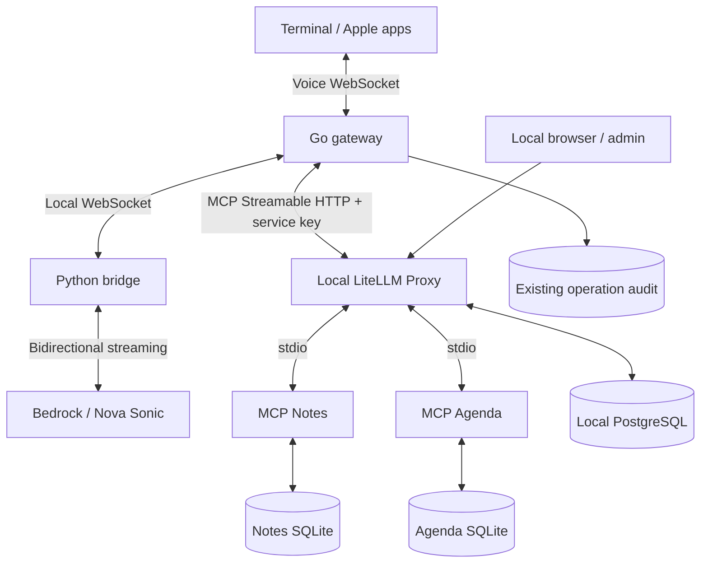

# LiteLLM MCP gateway — compatibility gate

Work branch: `codex/litellm-mcp-gateway`. The agreed first milestone blocks
migration unless host confirmation and durable idempotency survive the gateway.

## Result: migration blocked

The official PyPI stable wheel **LiteLLM 1.101.0** was inspected and its outbound
SDK call operation executed in isolation with a capturing session on 2026-09-18.
The operation forwards `name`, `arguments`, and `progress_callback`, but no
`meta`, even when the request carries the STS fields.

Wheel SHA-256:
`7cc623a224c6f11a04367a682b095a1e08e5f6da75c990a650910db5f9777819`.

Reproduce using the official wheel, without installing dependencies or AWS calls:

```sh
python3 scripts/check_litellm_metadata.py /absolute/path/litellm-1.101.0-py3-none-any.whl
```

Exit 1 means STS metadata was not preserved; exit 0 means this isolated client
check passed; exit 2 means inspection failed or the source shape changed.
Passing this check alone does not approve migration: full proxy acceptance is
still required. The check executes actual wheel code for the SDK call operation,
with a mock SDK session; it does not claim a running proxy or network test.

## Cause and impact

In `litellm/proxy/_experimental/mcp_server/server.py`,
`mcp_server_tool_call` creates `body_data` from name and arguments, without
forwarding STS request metadata. In `mcp_server_manager.py`,
`_call_regular_mcp_tool` constructs `MCPCallToolRequestParams` with only name
and arguments. Finally `experimental_mcp_client/client.py` invokes the MCP SDK
without metadata. All layers must preserve host metadata.

Our Notes and Agenda servers use `_meta.sts/idempotencyKey` for atomic durable
replay and `_meta.sts/confirmed` for destructive operations. Without these,
creation fails with a missing idempotency key and deletion/cancellation remains
blocked. Adding confirmation to model arguments or generating a fresh key in
LiteLLM would break the agreed security and retry contract.

No runtime migration, backend switch, database changes, or proxy installation
has been performed. The existing stdio backend remains operational.

## Intended local topology after compatibility is resolved



LiteLLM and PostgreSQL bind only to loopback. The intended admin panel is
`http://localhost:4000/ui`; neither that service nor its panel is running yet.
Go retains orchestration, schema validation, confirmation, operation identity,
and bounded results. LiteLLM owns centralized admission, server/tool grants,
service-key rotation and call limits. Notes and Agenda retain transactional
rules and durable replay. Nova traffic stays on its current bridge.

Initial governance: separate admin/service keys, explicit server/tool grants,
read-only and assistant profiles, `allow_all_keys` disabled, 60 tool calls/minute
per server/key, and payload-free operational logs. Do not assume full MCP log
visibility in the open source UI until the selected version is tested.

## Required next milestone

Recommended resolution: use an upstream stable release that forwards custom
call metadata across all three layers. An alternative is a maintained pinned
LiteLLM patch; adopting that changes the dependency maintenance scope and needs
an explicit decision. Do not ship a partial backend or silently bypass LiteLLM.

After metadata works, validate the actual proxy against both real stdio servers:
protocol version `2025-11-25`, preserved metadata, repeat/restart replay,
confirmation expiry/refusal, permission enforcement on direct invocation,
revoked keys, 429 limits, concurrency, timeout/unknown outcome, and absence of
payloads in logs and persistence. Only then implement and enable the Go HTTP
backend, preserving existing names and replay identities. No automatic mutation
retry or fallback to direct stdio is allowed.

Sources: [MCP gateway](https://docs.litellm.ai/docs/mcp),
[permissions and limits](https://docs.litellm.ai/docs/mcp_control),
[official package](https://pypi.org/project/litellm/1.101.0/).
